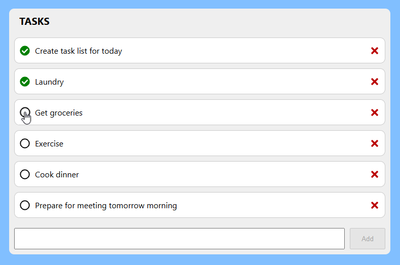

# To Do List

Application for recording and tracking task list items.

Built using React, TypeScript, Java Spring Boot, and PostgreSQL.



# Getting started

## System Requirements

- Node 20
- Java 21
- PostgreSQL

## Frontend

1. Install dependencies

   ```bash
   npm install
   ```

2. Run

   ```bash
   npm start
   ```

## Backend

1. Import project into Eclipse with Spring Boot
2. Run as Spring Boot application

## Database

1. Install PostgreSQL
2. Configure as per application.yml in backend application
